# Laboratorio 4 — Switch, router y TRUNK

| | |
|---|---|
| **Alumno** | David Martinez Rodriguez · A01832275 |
| **UF** | Interconexión de Dispositivos |
| **Campus** | ITESM Querétaro · 23 mayo 2024 |
| **Formato** | Reporte |

---

## Qué hicimos en el laboratorio

Esta práctica se pareció mucho a la del Lab 3 en lo físico: misma idea de mesa Admin01, consola por rollover, rack lleno de cables y el switch **ISP PRIMARIO**. La diferencia fue el foco en **VLANs**, el **TRUNK** entre switch y router, y el router con subinterfaces (**router-on-a-stick**) en lugar de dejar todo en una sola LAN plana.

Del QR me tocó el bloque **192.168.90.0** — o sea **X = 90** — y con eso armé el script `A01832275_Config.txt`.

### Cablear y ubicar el equipo

Igual que antes: Ethernet a la toma, consola al router/switch y en el rack buscar el puerto correcto entre un mar de cables de colores.

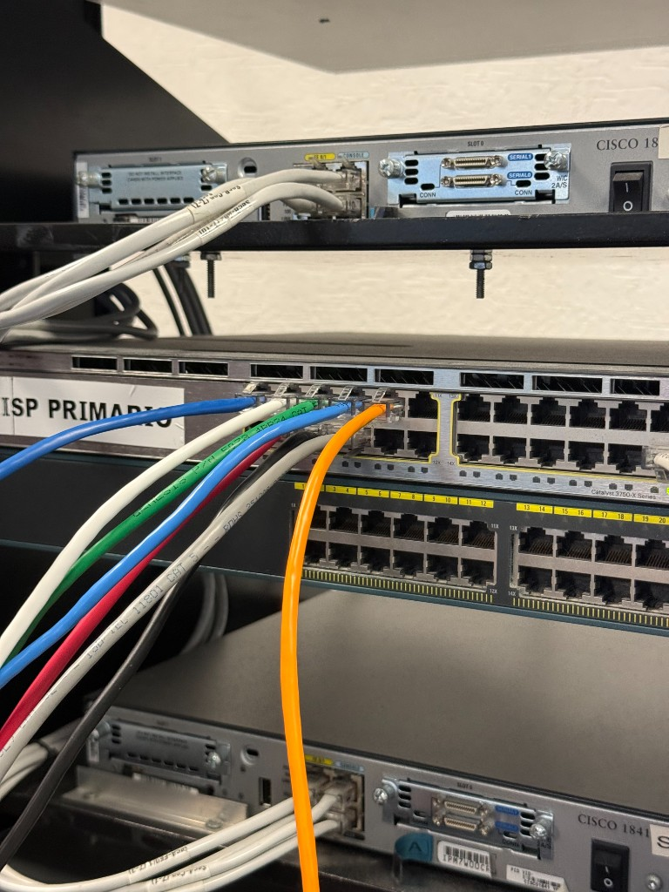

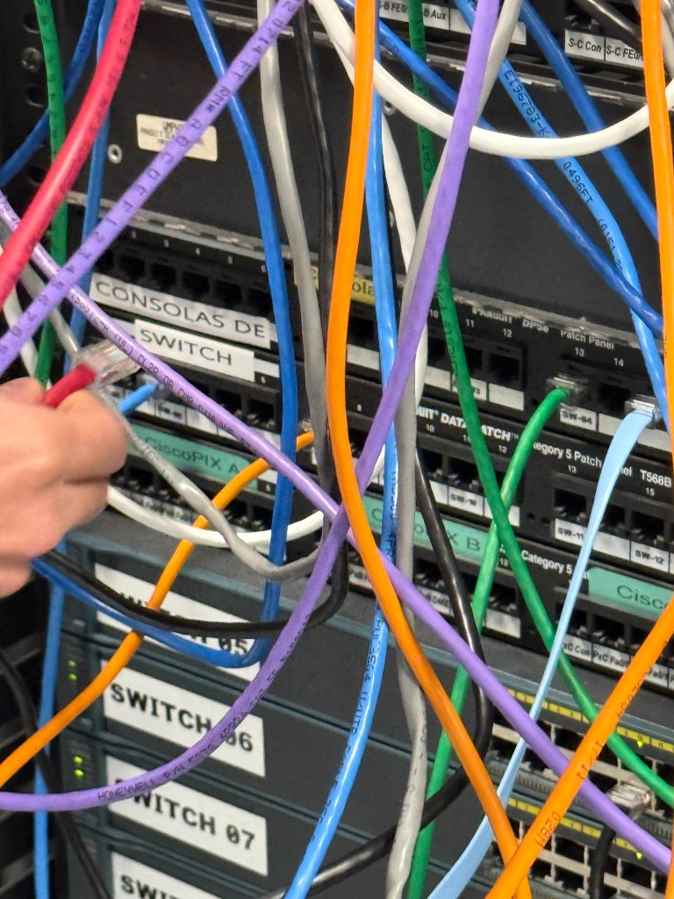

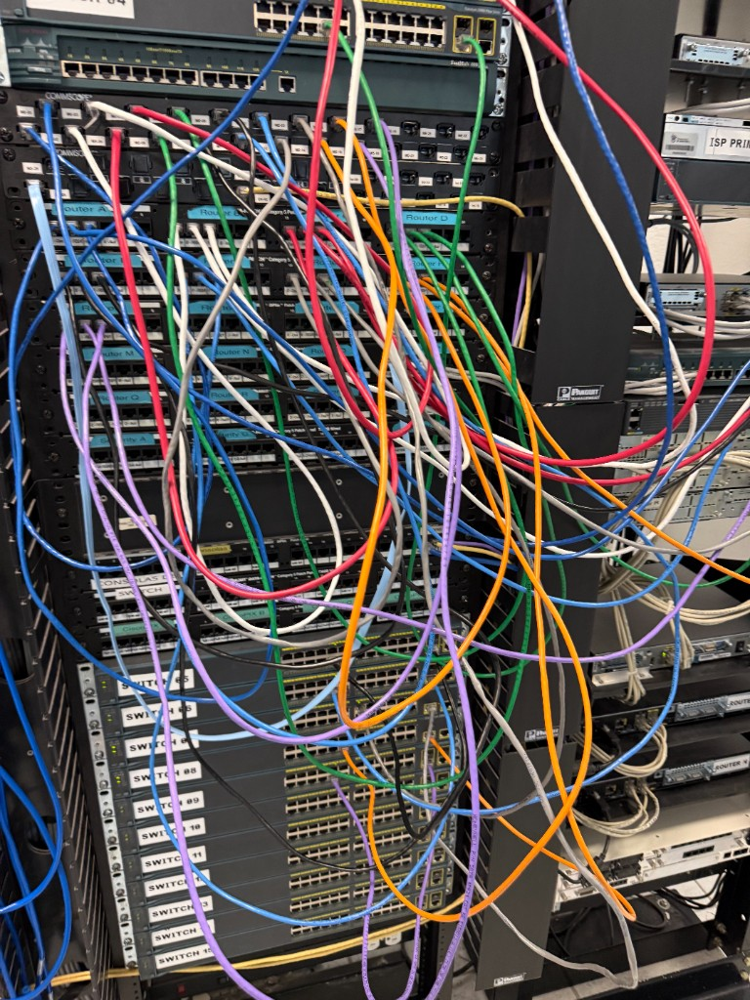

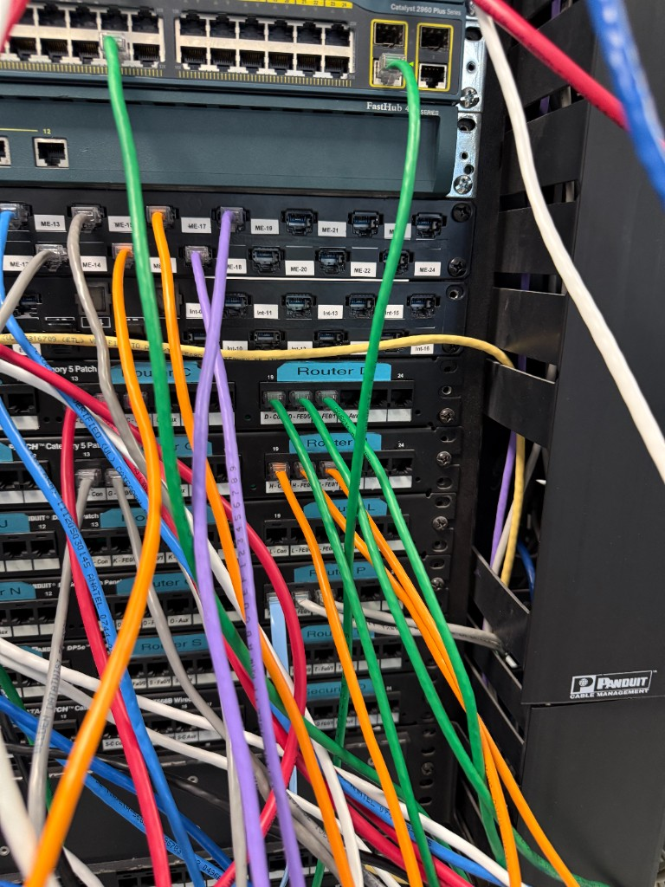

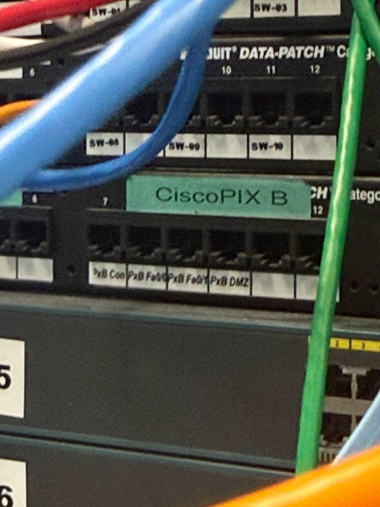

### Configurar el switch (VLANs y TRUNK)

En el switch separé redes por VLAN: **200** para cajas (puertos F0/1-6), **500** para gerencia (F0/10-16) y **911** para gestión con IP fija. Lo importante del lab fue poner **G0/1-2 en modo trunk** para que varias VLANs pasen hacia el router por un solo cable.

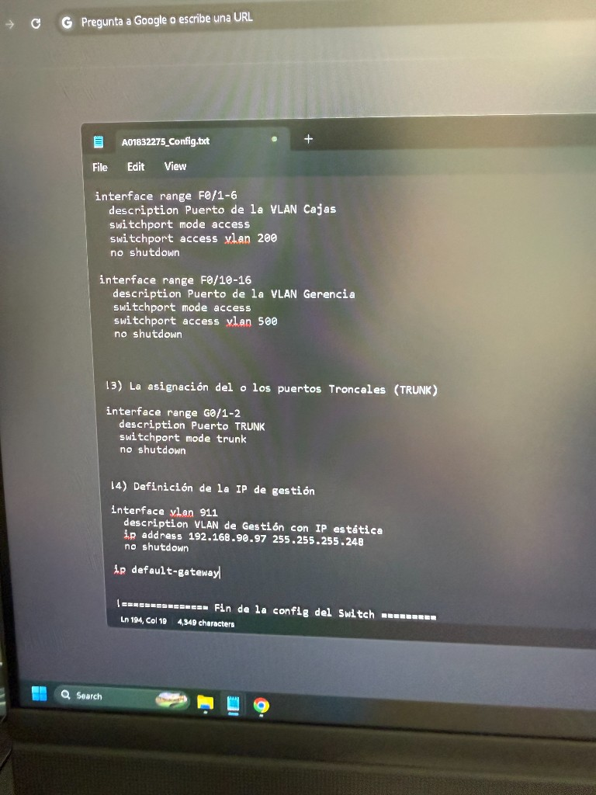

### Configurar el router (dot1Q)

En **RF-SucursalHmo** dejé **G0/0/0** hacia el ISP y en **G0/0/1** armé subinterfaces con `encapsulation dot1Q` (.100, .200, .500, .911), cada una con su IP del bloque 90. También quedó DHCP y exclusiones en el script, como en la práctica anterior.

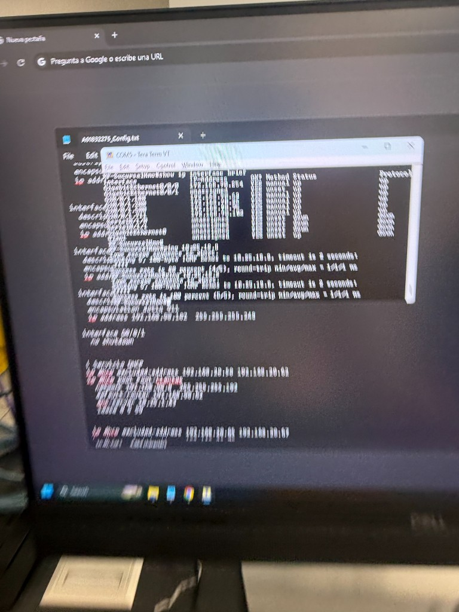

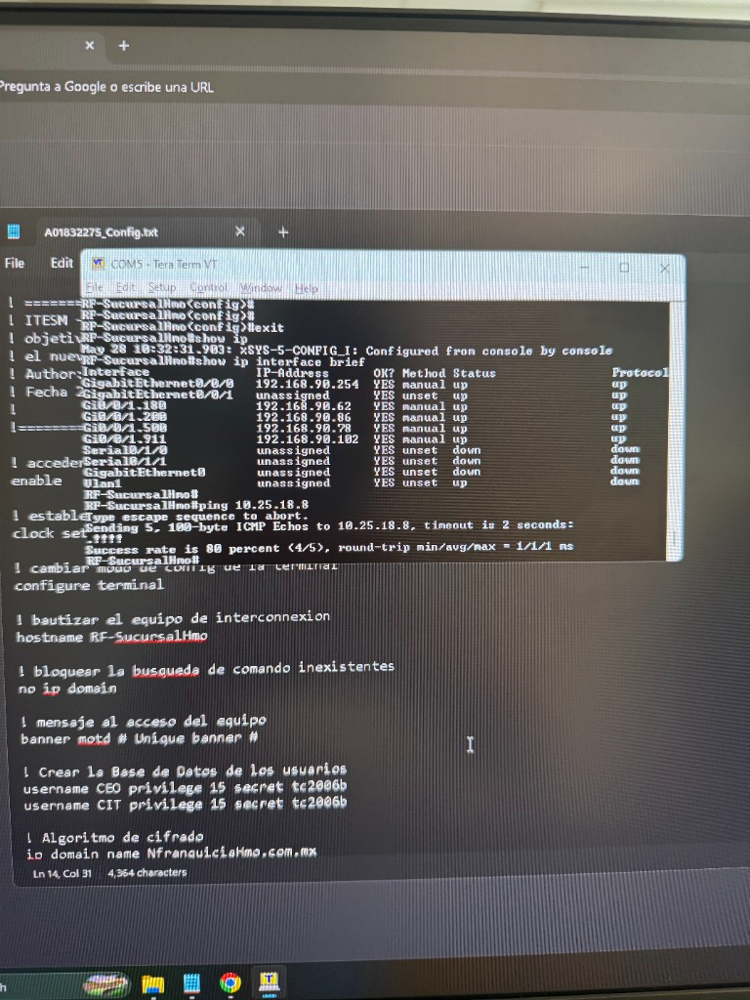

| Parte | Cómo quedó |
|-------|------------|
| ISP | G0/0/0 → 192.168.90.254 |
| Trunk hacia router | Switch G0/1-2 → `switchport mode trunk` |
| VLAN 200 (Cajas) | Access F0/1-6 |
| VLAN 500 (Gerencia) | Access F0/10-16 |
| Gestión | VLAN 911 → 192.168.90.97 |

### Probar que ya jala

Con todo aplicado, `show ip interface brief` mostró las subinterfaces arriba y el ping empezó a contestar. Desde Admin01 abrí **10.25.18.8/BurgerQ/**, **mitec**, **CNN** y **Cisco** — ahí supe que el trunk y el enrutamiento entre VLANs ya estaban bien.

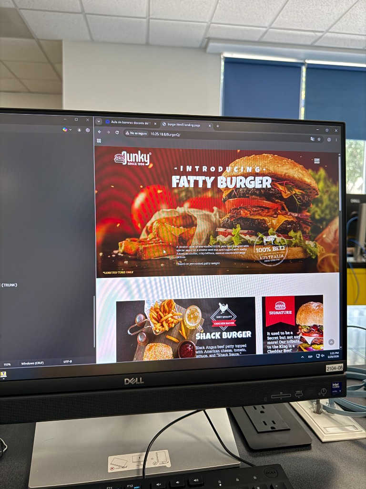

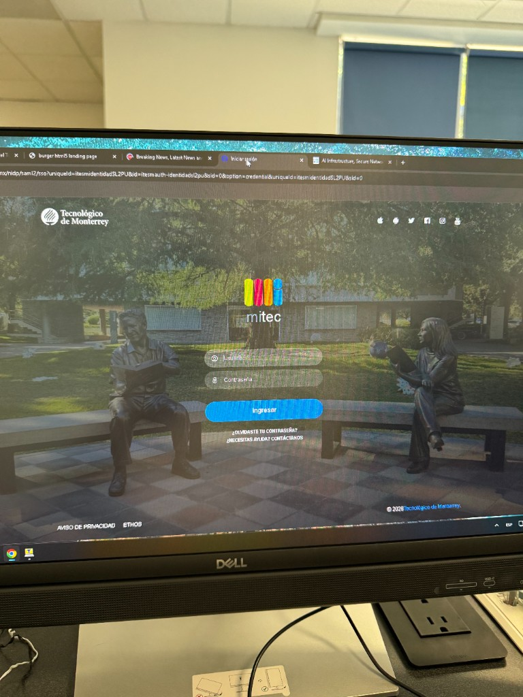

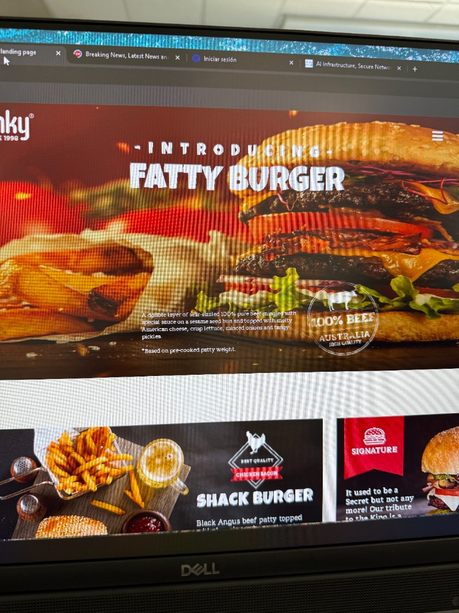

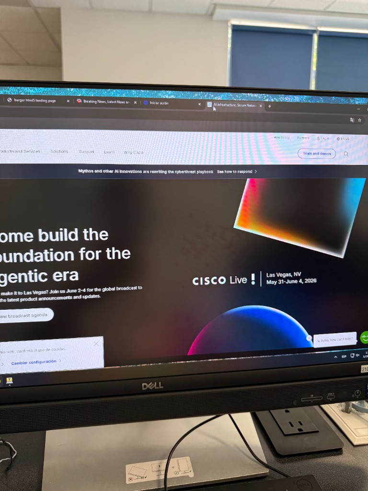

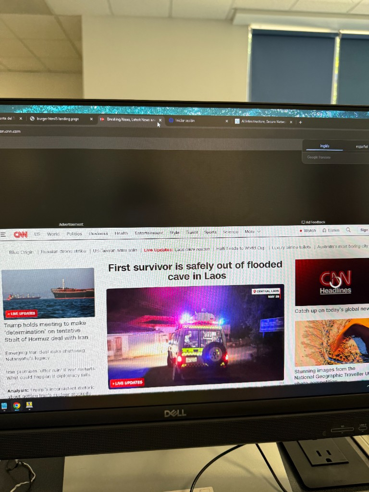

---

## Validación

| Prueba | Qué pasó |
|--------|----------|
| `show ip interface brief` | Subinterfaces .100, .200, .500, .911 en **up** |
| Ping desde el router | Contestó (80–100 % según el destino) |
| **10.25.18.8** / BurgerQ | Cargó la landing en el navegador |
| Internet (mitec, cnn, cisco) | Abrían sin problema |

En corto: el **trunk** lleva las VLANs al router; las subinterfaces con **dot1Q** las enrutan; **X = 90** salió del QR. Sin trunk, cada VLAN se queda aislada en el switch y no hay forma de que salgan a Internet o entre sí.

---

## Reflexión — accesibilidad e inclusión

Después del Lab 3 ya conocía el rack y las tomas, y eso bajó el estrés de esta práctica. Lo que más me costó fue no confundir puerto access con trunk, pero las etiquetas y el script en el bloc ayudaron. Configurar varias VLANs en switch y router se entiende mejor cuando ves los cables y luego el `show ip interface brief` en verde. El lab sigue siendo muy visual — colores, QR, consola — y eso ayuda a no quedarte solo con la teoría del manual.
