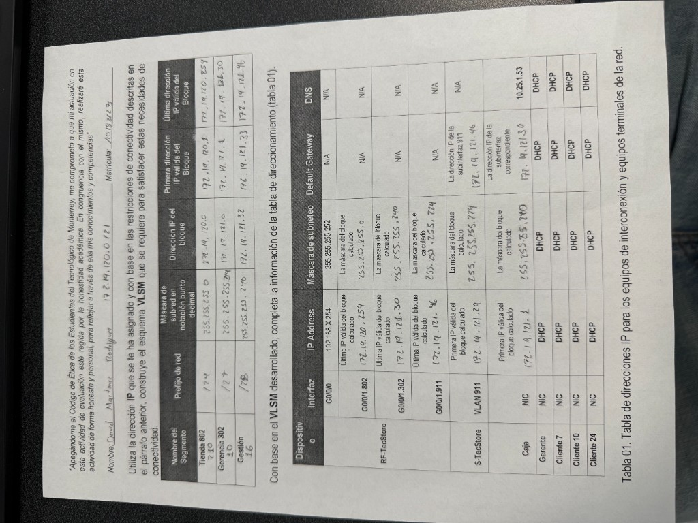
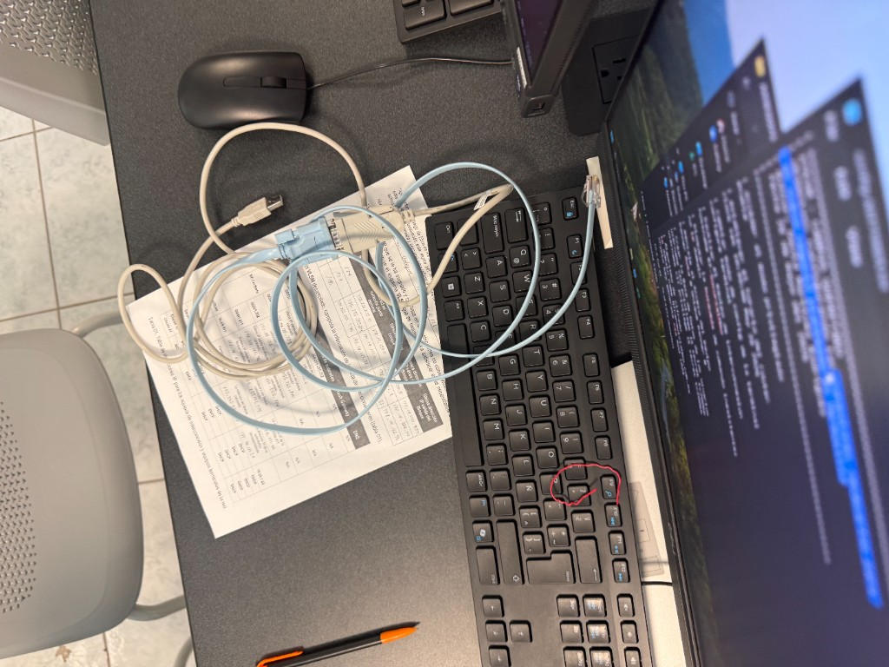
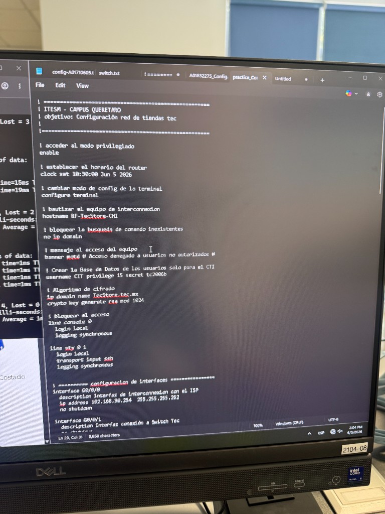
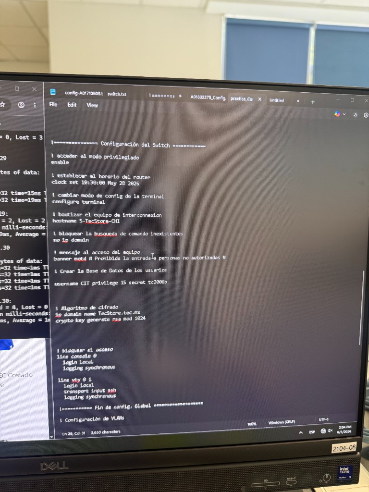
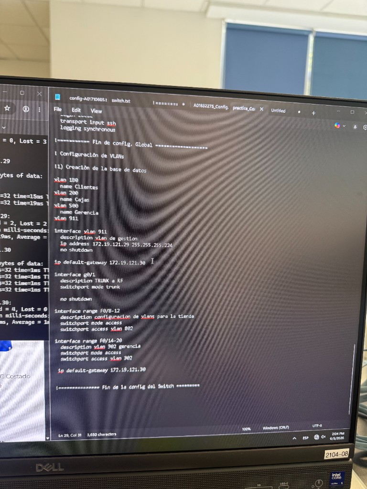
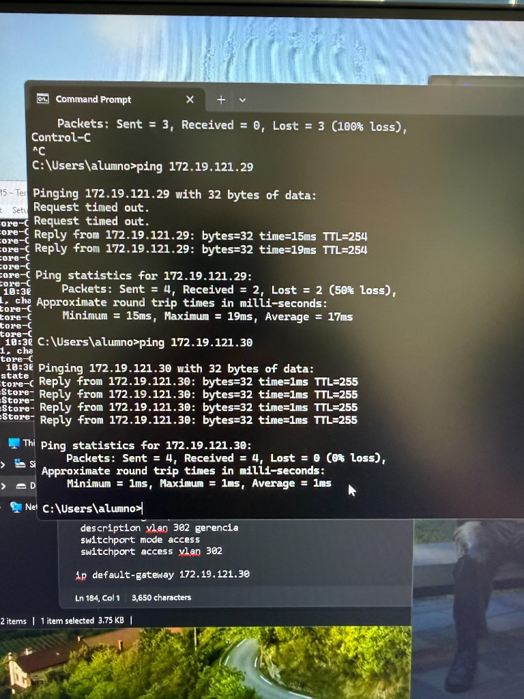
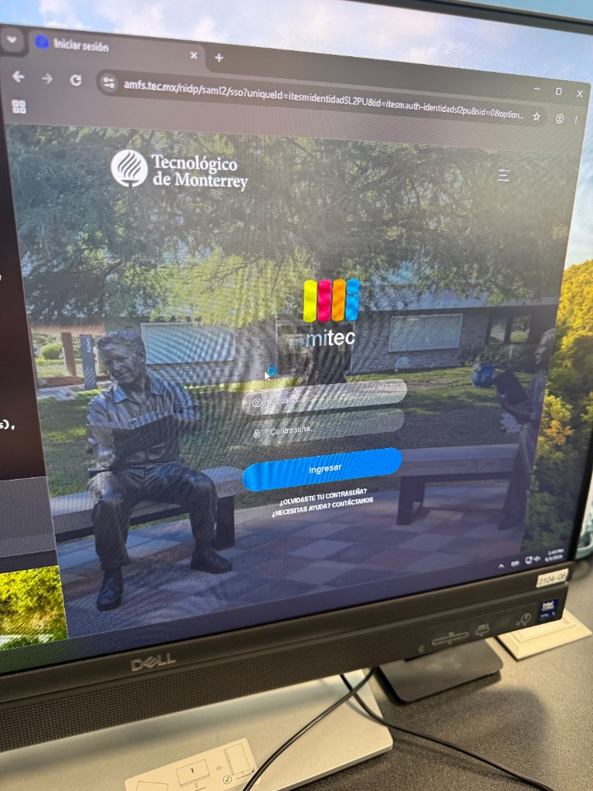
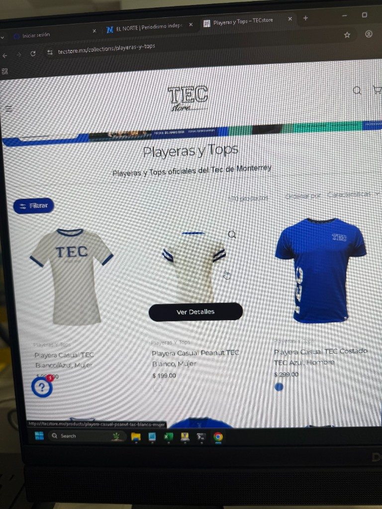
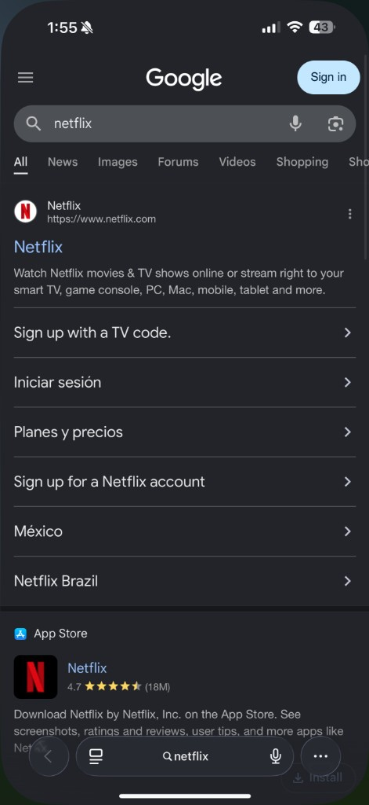
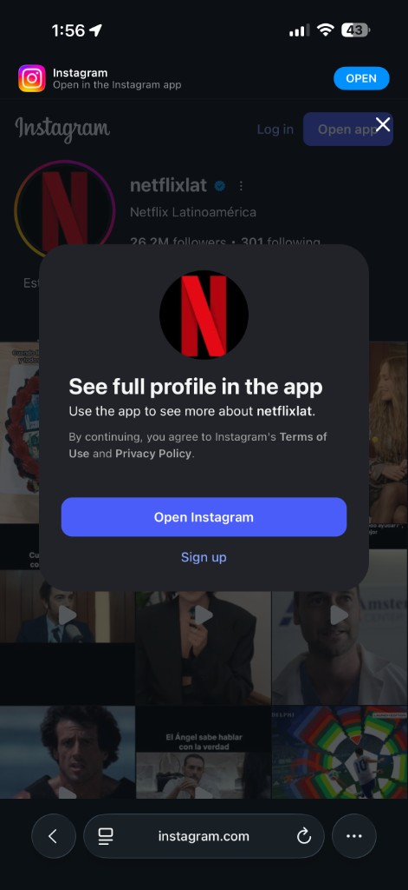

# Laboratorio 5 — Red Tec Store (VLSM, router y switch)

| | |
|---|---|
| **Alumno** | David Martinez Rodriguez · A01832275 |
| **UF** | Interconexión de Dispositivos |
| **Campus** | ITESM Querétaro · 5 junio 2026 |
| **Formato** | Reporte |

---

## Qué hicimos en el laboratorio

Tocaba dejar lista la red de una **TEC Store**: VLSM en papel, router, switch y probar que jalara desde Admin01.

Del QR salió **172.19.120.0/21**. Con eso llené la Tabla 01 y los scripts del **RF-TecStore-CHI** y **S-TecStore-CHI**.

### VLSM y tabla de direcciones

Partí el bloque en tres pedazos: **Tienda 802** (/24), **Gerencia 302** (/27) y **Gestión** (/28).

| Segmento | Prefijo | Bloque | Router |
|----------|---------|--------|--------|
| Tienda 802 | /24 | 172.19.120.0 | G0/0/1.802 → .254 |
| Gerencia 302 | /27 | 172.19.121.0 | G0/0/1.302 → .30 |
| Gestión | /28 | 172.19.121.32 | G0/0/1.911 → .46 |

### Cablear la estación

Bloc con la tabla a la vista, rollover a consola y Ethernet a la toma. Lo de siempre, pero con IPs de tienda.

### Router y switch

Router: banner, usuario **CIT**, SSH, **G0/0/0** al ISP y subinterfaces dot1Q en **G0/0/1**.

Switch: VLANs, **G0/1 en trunk**, access en F0/8-12 y F0/14-20, SVI en **911** con gateway **172.19.121.30**.

| Parte | Cómo quedó |
|-------|------------|
| Trunk | G0/1 → `switchport mode trunk` |
| Tienda | F0/8-12 → VLAN 802 |
| Gerencia | F0/14-20 → VLAN 302 |
| Gestión | VLAN 911 → .29 / gw .30 |

### Probar que ya jala

Ping a **172.19.121.30** (gw) respondió al 100 %. A **172.19.121.29** (switch) al principio fallaba la mitad; ya estabilizó al terminar la config.

Después abrí **mitec**, **EL NORTE**, **tecstore.mx** y desde el cel Netflix e Instagram. Todo cargó.

---

## Validación

| Prueba | Qué pasó |
|--------|----------|
| Ping **172.19.121.30** | 0 % pérdida, ~1 ms |
| Ping **172.19.121.29** | Raro al inicio; luego bien |
| **mitec** / **elnorte** / **tecstore** | Abrían |
| Celular (Netflix, IG) | Cargó normal |

En corto: VLSM reparte las subredes, el router las enruta y el trunk las sube hasia el RF. Si el cálculo sale mal, las IPs se pisan.

---

## Reflexión — accesibilidad e inclusión

Tener la Tabla 01 en papel al lado de la consola me ahorró regresar al PDF cada vez que dudaba de una máscara. El VLSM suena fácil en clase; aquí se nota cuando Gerencia es /27 y Gestión /28 en el mismo bloque. Probar con paginas reales (mitec, tecstore) confirma que no solo hay ping, sino DNS y salida a Internet.
